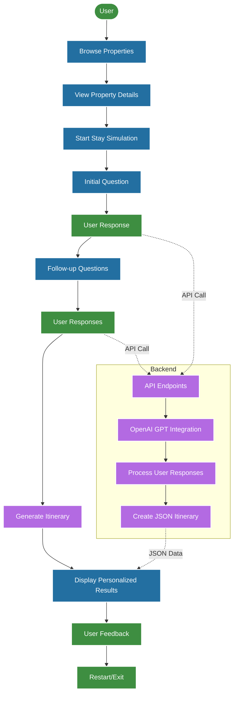

# StayVision

StayVision's "Simulate Your Stay" feature enhances property browsing by allowing guests to experience a personalised stay simulation before booking.

**Demo Link:** [**https://stay-vision.vercel.app**](https://stay-vision.vercel.app)

**Backend Server:** [**https://stay-vision-backend.vercel.app**](https://stay-vision-backend.vercel.app)

## Why It Matters
Staying Experience Simulation transforms property browsing from static scrolling into an immersive, personalised journey. By letting guests “try before they buy,” it sparks excitement, builds trust and sets a new digital hospitality standard, while the expectation match ensures the experience keeps getting better.

    
     
    
    
     
    <em>Screenshots of the StayVision simulation interface demo</em>

## How It Works
1. **Property Selection**: Guests choose a property they are interested in.
2. **Personalised Simulation**: The AI generates a tailored stay simulation based on the property details and user preferences.
3. **Interactive Experience**: Guests can explore the simulation, ask questions, and receive personalised recommendations.
4. **Feedback Loop**: Guests can provide feedback on the simulation, which helps improve future simulations.

   
  <em>System Design Diagram</em>
   
  <em><small>Can't see the diagram? <a href="https://github.com/Tomazing/StayVision/blob/main/frontend/src/assets/system_design.png?raw=true">View system design image</a></small></em>

## Tech Stack
- **Frontend**: React, TypeScript, Tailwind CSS, Vite
- **Backend**: Node.js, Express, OpenAI API
- **Deployment**: Vercel for frontend and backend